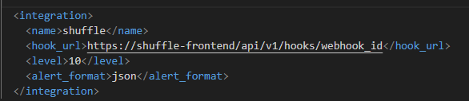

# VALOR H2

## Apuntes

-Para lanzar el proyecto es necesario lanzar como sudo el 'deployment.sh'. 

-En ninguno de los casos vendrá preconfigurado Wazuh ya que la versión dockerizada no permite exportar la base de datos, por lo que será necesario
realizar configuraciones manuales siguiendo la guía oficial: https://documentation.wazuh.com/current/deployment-options/docker/wazuh-container.html. 

-Para incluir la integración de Shuffle en Wazuh, el bloque que se debe introducir en el ossec.conf es el siguiente:

Donde webhook_id será el identificador del hook que aparecerá al importar el flujo de trabajo dentro de Shuffle. Tras ello, guardar el ossec.conf y reiniciar el cluster.

-En caso de error en el despliegue de MISP, repetir el docker compose up -d. En ocasiones los contenedores misp-core/misp-modules dan errores al ser el primer despliegue. Además puede tardar unos minutos en aparecer como accesible en el navegador.

-MISP no viene preconfigurado, por lo tanto las credenciales serán las predefinidas (están al final del documento). Será necesario para hacer funcionar la aplicación obtener una Auth Key (Admin->Auth Keys->Add authentication key). Anota esa key para introducirla después en Shuffle.
También será necesario descargar feeds para buscar los eventos (Sync Actions -> Feeds). Seleccionando las dos que aparecen se pueden activar en primer lugar para después ya descargarlas en "Fetch and store all feed data".

-El test_valorh2.json es el flujo de trabajo de Shuffle. Viene preconfigurado con API Keys usadas en el despliegue de prueba. En caso de que se hayan usado los backup a priori no deberían cambiar, en caso contrario deberán ajustarse con las nuevas API Keys de MISP, etc. Importar este flujo en caso de que no se hayan usado los backups, en caso contrario debería aparecer ya.

-El openapi.json contiene los endpoints de la API de DFIR IRIS. En caso de que de primeras el workflow no reconozca la app se deberá importar dicho JSON en la sección de Create App -> Upload OpenAPI. Nombre de la app: IRIS 2 0 2

-La carpeta de DRL contiene toda la parte de investigación en Threat Intel y DRL. En el flujo de Shuffle se indica donde se usaría esta parte, pero no está activa en el flujo.

-IRIS viene con un backup anterior de su base de datos, por lo que a priori no es necesario cambiar la API_KEY de IRIS en Shuffle.

**CREDENCIALES**

-MISP
    Usuario:admin@admin.test

    Contraseña:admin

-IRIS
    Usuario:administrator

    Contraseña:chv7uev3ahg@rjf@ZND

